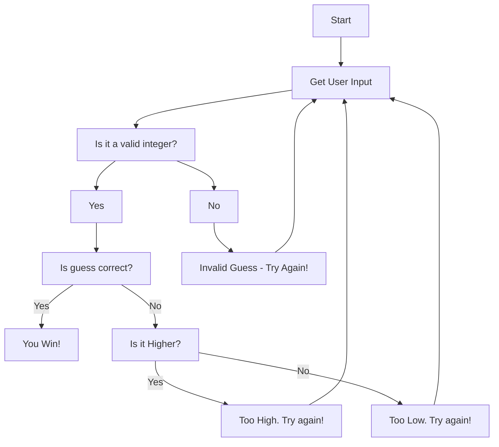

 **Game Flow**

1. **Game Start**

2. **Get User Input**
   * Prompt the player to enter their guess.

3. **Validate Input**
   * **IF** the input is a valid integer:
     * Proceed to the next step.
   * **ELSE:**
     * Display "**Invalid Guess. Try again!**"
     * Return to the "Get User Input" step.

4. **Check Guess**
   * **IF** the guess is correct:
     * Display "**You Win!**"
     * End the game.
   * **ELSE:**
     * **IF** the guess is higher than the correct number:
       * Display "**Too High. Try again!**"
     * **ELSE:** (The guess is lower)
       * Display "**Too Low. Try again!**"
     * Return to the "Get User Input" step.
