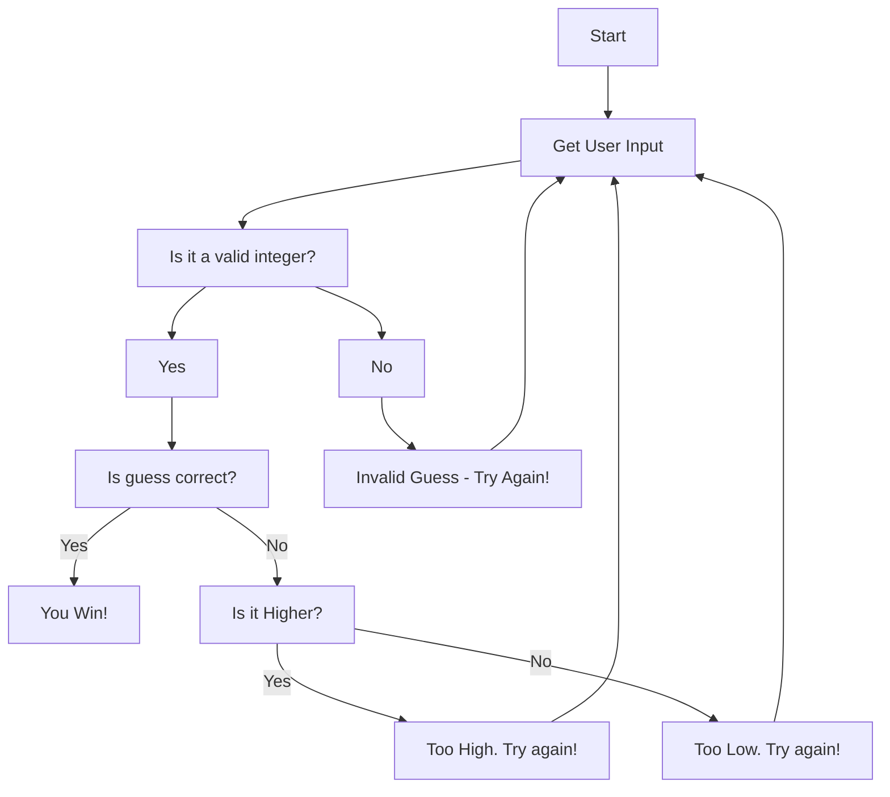

The game begins and the player is prompted to enter their guess. The game checks if the input is a valid integer. If it is a valid integer, the game proceeds to the next step. If it is not a valid integer, the game displays "Invalid Guess. Try again!" and returns to the "Get User Input" step, so the user can guess another number. If the guess is a valid integer, the code checks if the guess is correct. If it is, the game displays "You Win!" and the game ends. However, if the guess is not correct, the game checks if the user's guess is higher or lower than the correct guess. If the guess is higher, the game displays "Too High. Try again!" and goes back to prompting the user to guess again. If no, the game displays "Too Low. Try again!", and goes back to prompting the user to guess again. 
